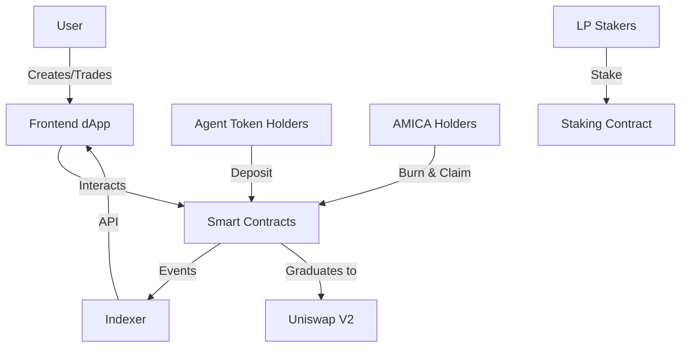

# Amica Protocol 🤖💫

[](https://opensource.org/licenses/MIT)
[](https://soliditylang.org)
[](https://www.typescriptlang.org/)

> A decentralized platform for creating, trading, and interacting with AI personas through blockchain technology

## 🌟 Overview

Amica Protocol revolutionizes AI monetization by enabling creators to launch ERC20 tokens representing AI personas. Each persona is a customizable 3D AI character capable of natural conversation, service provision, and autonomous economic activity. The protocol features bonding curves for fair price discovery, automatic graduation to Uniswap, and innovative agent token integration that allows existing crypto communities to participate in AI persona launches.

### Key Innovations

- 🎭 **AI Persona NFTs**: Each persona is an ERC721 NFT with an associated ERC20 token
- 📈 **Bonding Curves**: Bancor-style automated market making for fair launches
- 🤝 **Agent Token Integration**: Existing token communities can participate with dedicated rewards
- 🔄 **Auto-Graduation**: Automatic Uniswap V2 pair creation at configurable thresholds
- 💰 **Fee Reduction**: AMICA holders enjoy trading fee discounts up to 100%
- 🔥 **Burn & Claim**: Burn AMICA to claim proportional share of all deposited tokens
- 🌾 **Staking Rewards**: MasterChef-style LP staking with 1.5x boost for agent pools
- 🌐 **Multi-Chain**: Deploy seamlessly across Ethereum, Base, Arbitrum, and other EVM chains

## 📁 Repository Structure

This monorepo contains all components of the Amica Protocol ecosystem:

```
amica-protocol/
├── contract/          # Smart contracts (Solidity)
└── docs/              # Documentation
├── website/           # Frontend dApp (Next.js)
├── subsquid/          # Multi-chain indexer
└── paper/             # Technical whitepaper (LaTeX)
```

## 🚀 Quick Start

### Prerequisites

- Node.js 18+
- Yarn or npm
- Docker & Docker Compose
- Hardhat
- RPC endpoints for target chains

### Installation

```bash
# Clone the repository
git clone https://github.com/your-org/amica-protocol
cd amica-protocol

# Install dependencies for all packages
yarn install # or npm install
```

### Contract Deployment

```bash
cd contract

# Copy and configure environment
cp .env.example .env
# Edit .env with your RPC URLs and private keys

# Compile contracts
npx hardhat compile

# Deploy to a network (e.g., Base)
npx hardhat run scripts/deploy.ts --network base

# Verify contracts
npx hardhat verify --network base DEPLOYED_ADDRESS
```

### Run the Frontend

```bash
cd website

# Configure environment
cp .env.example .env.local
# Add your WalletConnect Project ID and API URL

# Start development server
yarn dev
# Visit http://localhost:3000
```

### Start the Indexer

```bash
cd subsquid

# Configure environment
cp .env.example .env
# Add your RPC endpoints and contract addresses

# Start services
docker-compose up -d

# Run the indexer
npm run dev
```

## 💸 Tokenomics

### AMICA Token
- **Total Supply**: 1,000,000,000 AMICA
- **Utility**: Persona creation, fee discounts, burn-to-claim, governance

### Persona Tokens
Each persona has 1B tokens distributed as:

**Without Agent Token:**
- 33.33% - Bonding curve
- 33.33% - AMICA deposit
- 33.34% - Uniswap liquidity

**With Agent Token:**
- 33.33% - Uniswap liquidity
- 22.22% - Bonding curve
- 22.22% - AMICA deposit
- 22.23% - Agent rewards

## 🛠️ Technical Stack

- **Smart Contracts**: Solidity 0.8.24, OpenZeppelin, Hardhat
- **Frontend**: Next.js, TypeScript, wagmi, RainbowKit, TailwindCSS
- **Indexer**: Subsquid, PostgreSQL, GraphQL, TypeORM
- **Infrastructure**: Docker, Kubernetes (optional)
- **AI Integration**: Three.js, @pixiv/three-vrm, LLM providers

## 📊 Architecture



## 🔗 Contract Addresses

### Mainnet (Ethereum)
- AMICA Token: `0x...`
- PersonaTokenFactory: `0x...`
- PersonaStakingRewards: `0x...`

### Base
- AMICA Token: `0x...`
- PersonaTokenFactory: `0x...`
- AmicaBridgeWrapper: `0x...`

### Arbitrum
- AMICA Token: `0x...`
- PersonaTokenFactory: `0x...`
- AmicaBridgeWrapper: `0x...`

*See [contract/README.md](./contract/README.md) for full deployment details*

## 🧪 Testing

### Smart Contracts
```bash
cd contract
npm test
npm run test:coverage
npm run test:gas
```

### Frontend
```bash
cd website
npm test
npm run lint
```

## 🤝 Contributing

We welcome contributions! Please see our [Contributing Guidelines](CONTRIBUTING.md).

1. Fork the repository
2. Create your feature branch (`git checkout -b feature/amazing-feature`)
3. Commit your changes (`git commit -m 'Add amazing feature'`)
4. Push to the branch (`git push origin feature/amazing-feature`)
5. Open a Pull Request

## 📚 Documentation

- [Smart Contracts](./contract/README.md) - Contract architecture and deployment
- [Frontend](./website/README.md) - dApp development guide
- [Indexer](./subsquid/README.md) - Multi-chain indexing setup
- [Whitepaper](./paper/amica.pdf) - Technical and economic details
- [Docs](https://docs.heyamica.com) - Comprehensive protocol documentation

## 🌐 Links

- Website: [heyamica.com](https://heyamica.com)
- Documentation: [docs.heyamica.com](https://docs.heyamica.com)
- Twitter: [@heyamica](https://twitter.com/heyamica)

## ⚠️ Disclaimer

This software is provided "as is", without warranty of any kind. Use at your own risk. Always do your own research and audit smart contracts before interacting with them.

---

*Built with ❤️ by the Amica team*
